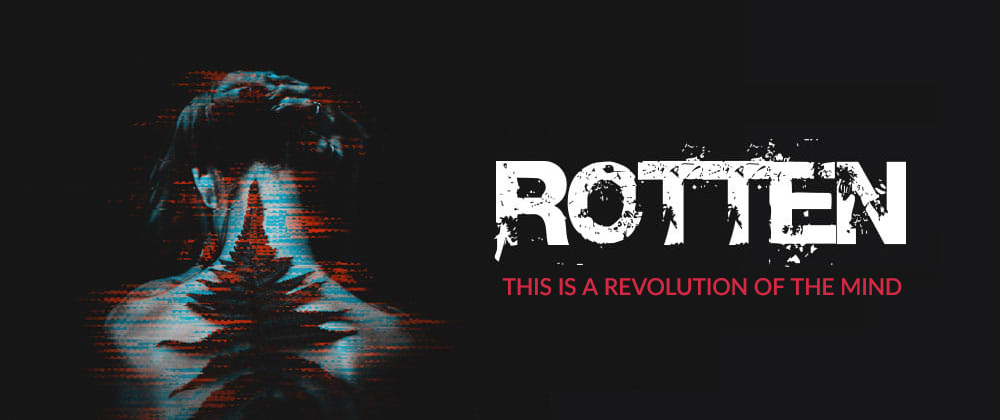

# Rotten
### A cyberpunk novel by Luca Grandicelli

Rotten is a revolution of the mind. Writing that becomes psychoanalysis and pierces the reader's heart, throwing him into a whirlwind of emotions and action, where the real challenge is to arrive alive until the end.

> *Luca Grandicelli signs his debut novel with a story bordering on madness: a book that is like a punch in the stomach and one in the heart; which leaves you breathless but at the same time irrevocably denounces the fragility and cruelty of the human soul.*

### The story
Charlotte is a young rockstar from the Block 31 who struggles to survive between synthetic heroin and punk gigs. When her lifelong manager finds her pouring into a puddle of vomit in bathroom N°5 of the Bar Mexico, she realizes she's sinking one step at a time into the abyss. But the Sprawl has a much more bitter future in store for her.

Rotten is a journey through the abysses of soul and mind, in search of a truth hidden under the skin and a past too heavy to bear.

## Book Chapters
1. [Awakening](chapter1-awakening.md)
2. [Bar Mexico](chapter2-bar-mexico.md)
3. A wayout
4. Limbo
5. Rubber boots
6. Soul's emptiness
7. Long hard road out of hell
8. Blue stillness
9. The rain circle
10. Ash blonde
11. Epilogue

### Disclaimer
**Given the nature of the contents and the style with which they are narrated, this book is for ADULT AUDIENCES ONLY. It contains substantial sexually explicit scenes and violence which may be considered offensive by some readers. Readers discretion is advised.**

### Note from the author
*Rotten is a work of fantasy. The story, all names, characters, and incidents portrayed in this book are fictitious. No identification with actual persons (living or deceased), places, buildings, and products is intended or should be inferred.

Since english is not my native language, i tried to translate the whole text preserving the original style, using sometimes terms and words that might sound particular. If you encounter any mistake, please let me know and report in the comments or open a PR on the book's [Github Page](https://github.com/lucagrandicelli/Rotten-Cyberpunk-Novel).
**Thank you**.

### Wanna translate this book?
If you'd like to translate this book, please fork this repo and submit your PR.

---

Copyright &copy; 2017 - 2021 - [Luca Grandicelli](https://github.com/lucagrandicelli/)\
Rotten is a self-published novel also available as ebook or paper version <a href="https://www.amazon.it/Rotten-Luca-Grandicelli-ebook/dp/B01MRAMS7J/" target="_blank">here</a>.
