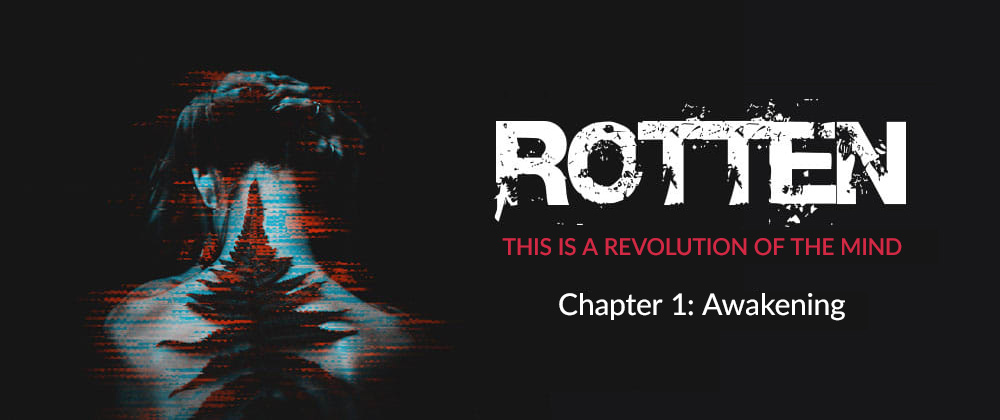

# Chapter 1: Awakening
Charlotte was lying in a pool of vomit.\
Face down with her body twisted in an unnatural position, she could almost feel the cold bathroom floor extending beneath her, like an expanse of immobile ice crushed under her swollen and heavy breasts, now barely held back by her tight lycra blouse. Her hair gathered in oily cerulean strands arching up to penetrate every single orifice of the face, while her damp cheeks were mixed with the fetid sewages that copiously dripped from her mouth. She gasped and a smell of piss entered her veins. Her moans cut through the air in sinuous melodies and the void seemed to stand between her and the surrounding world; a thin layer of ethereal essence that isolated her from everything around but the beats of her heart: dark and black; that at every stroke she seemed to sink one step at a time towards the abyss. A whole life or a tiny fragments of it; quite difficult to say how much that instant seemed to last: a few hours or all eternity.

When she finally opened her eyes her sight was completely cloudy and a glassy and sharp light seemed to penetrate her soul. Charlotte could barely see the objects all around: only fuzzy shadows that just like little demons seemed to surround her, standing out unperturbed. Watching her; craving her. Under the pale, buzzing light of the neon lamp placed just above the window, they seemed to vibrate, waiting for a start, for a noise that roused them and made them melt like tar in the sun. Finally, with an effort that seemed superhuman, she absently tried to stand up, first bringing her legs to her belly and then turning around to a prone position. But at each attempt her knees gave way, letting her fall with a thudding sound to the floor and causing her a sharp pain in the chest. She could feel her own blood flowing as thick as oil through her pale veins just below the surface of the skin. With broken fingernails screeching on the vomit-soaked tiles, she then tried to grab the first shadow beside her, but a moan immediately died in her throat: she felt a finger being ripped open and a sharp pain crossing her hand. As if by magic, she suddenly awoke from that chemical numbness with the vision finally becoming sharper enough to allow her to focus on the details all around. She saw the blood dripping from her fingertips and the microsyringe on the ground a little further on. In a leaden silence interrupted only by the dripping dampness of the ceiling, her breath grew heavier, more and more rancid.

Charlotte felt nothing, except for a great feeling of emptiness that corroded her from the inside, intoxicating her until she was rotten, like that word tattooed on her left forearm when she was just nine years old. She knew that the effect of the synthetic heroin was now gone, and that hell had just fallen on her. The soul, if she had ever had it, had just spewed it out. She tried to scream, but all that came out of her mouth was a muffled gasp. Suddenly, she saw the bathroom door open and a light from the outside corridor creepily crawling toward her body.\
When she tried to look at the face of who had just entered, Charlotte was shaken by a start.\
She broke into a cough, and then pissed herself.

---

[Chapters Index](https://github.com/lucagrandicelli/Rotten-Cyberpunk-Novel)

--

Copyright &copy; 2017 - 2021 - [Luca Grandicelli](https://github.com/lucagrandicelli/)\
Rotten is a self-published novel also available as ebook or paper version <a href="https://www.amazon.it/Rotten-Luca-Grandicelli-ebook/dp/B01MRAMS7J/" target="_blank">here</a>.
