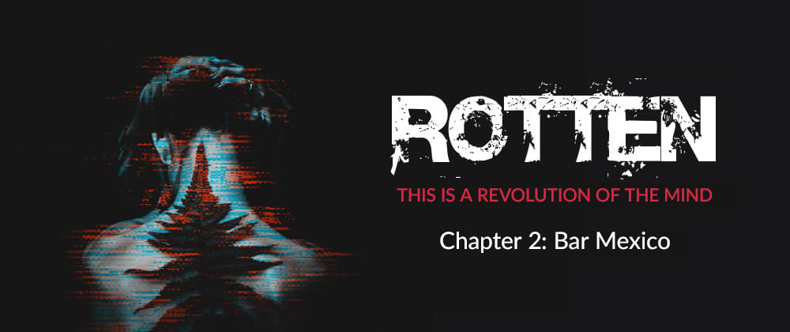

# Chapter 2: Bar Mexico
The bottom of the glass looked like a kaleidoscopic block of poisoned crystalline. Alan watched it spinning, accompanying the movement with the tip of his thumb and forefinger of his hand. A faint drop of Tequila '79 floated alone along the encrusted edge of the glass, weakly heated by the heat of the counter and the air now saturated with nicotine. John The Barman spent half an hour telling him how that stuff was the best around the Block 31: "First quality", he gasped. Not that Alan didn't believe him, but he had already heard that story at least a hundred times that quickly became a classic. Customers believed it, or at least pretended to, and so he did. The truth was that that shit wouldn't even have been thrown down by the rats, but since in the outer blocks a definetely worse stuff used to circulate, all in all that was fine.
He greedily drained the last sip, remaining with the glass at midair a moment longer than usual, patiently waiting for the last drop to fall straight down his throat while the bluish light of the biochip under his wrist wedged infamously, wetting his pupils and blinding his eyes.\
“Damn. One of these days i gotta have it removed."\
Then he noisily placed the glass on the bar, dodging a couple of unlit butts and absently spying on the barman intent on arranging the usual bottles on the shelf behind him.
John and his goddamn fucking implant. Fuck himself.\
He spent a fortune getting it and almost lost the club. Cheap stuff; poor installation. A real pity.\
It was that kind of installation job you can tipically find in the outer blocks. And they used not to be quite gentle around there; if you got caught with a bunch of money in the middle of the balls, they would most likely leave you barely a piss hole instead of the connectors. But John still enjoyed it: at least he was still alive. Now, however, he had two beautiful huge nipple-shaped scars all along his cerebellum and the area of ​​the attachments turned into a purplish color. Too bad that instead of getting his knob sucked by some slut, it was the machines that sucked him. However, Alan decided not to tell him anything; if only because everyone in the Sprawl had some kind of implant grafted into their own bodies, and in those areas it was full of people who would sell themselves a kidney or a cornea in order to get modified. The Government had made some models legal and with the passage of time, even in the first blocks, up in the residential districts, all kinds of models began to circulate. These were mostly standard, often very expensive devices installed by overpaid surgeons who opened and stitched you up without a trace. Professional work, no doubt about it. And those dicks were crazy about it.\
But down in the outer blocks the situation was very different. The black market was now rampant everywhere and often not even registered models circulated. Experimental devices, which did not take anything to get your brain burnt. They sold them to you for a coin or a few units of synthetic heroin, but if you weren't careful you would end up "burned" like everyone else: thrown to rot in the ditches until the rats finished nibbling you piece by piece. And it was a matter of time after all. With all that unauthorized stuff running around, you never knew if you could get stuck on it or not. It was enough to stay attached for a long time and your brain and the machines did tilt. The lucky few who managed to disconnect in time suffered a neurofacial hysteria that lasted for days. Horrible to see and usually they resumed mumbling a few words only after months of rehabilitation. But John thought that wasn't the problem. If it were up to him, the world would have been a better place if everyone got modified.
"It's the New Human, mate: a higher level of consciousness."\
Alan always disliked that theory. Playing dice with his brain did not seem like a wise choice, especially in light of the fact that you never knew how deep you could go, and judging by the hordes of psycho-psychics that roamed the back of the club on friday nights, that turned out to be a good choice.\
"Perfection is not of this world, neither in the Block 31."\
But who should have cared? Alan had long since learned to carefully choose the words to use.\
"Every bloody individual has his own protocol and you'd better learn it quickly", he heard himself say once after a fight outside the Bar. He repeated it practically every day and, for better or for worse, had allowed him to stay away from trouble.

«Nice concert tonight, huh?»\
John threw up those words in a rush, while he was intent on nervously cleaning the bar counter as if it was made of some precious crystal.\
«That Charlotte over there is hot. I'd like to lick her minnie for you one of these evenings after the show», he continued.\
Alan watched his face contort into a strange grin, halfway between laughter and neurofacial hysteria.\
«Get right with the words John. or i'll take your head off and shit in it.»\
The barman stared at him for a moment. Then, as if nothing had happened, relaxed turning his back.\
«Quiet mate, i was joking. If it weren't for her and that band of hers to pull up on friday nights, we'd have more of a problem with the cashier. And you could forget that fucking Tequila of yours» he added, winking at the now empty glass in Alan's hand.\
«Yeah, sure, right. Well now, do me the fucking favor: gimme another one.»\
What was in that liquor Alan never knew, but all in all it did its dirty job and for some strange reason the whole place seemed to go around it.\
«What the fuck, man, i told you it was first-choice-stuff. Not that crap you find down at the port. Say, have you ever gone beyond Block 35, huh?»\
«Once i had. And it was enough for me. But if i ever had to implant myself, i certainly wouldn't go all the way over to those nerve-eaters». Thus pointing with the glass still empty to John's nipple-shaped holes.\
«Nerve-eaters? Ah! Now is that what you call them? No, i say, look at my implant: some specialist stuff!»\
John The Barman's head spun around revealing a mass of attacks that in the meantime had strangely begun to get filled with some greenish liquid. Then, showing off his usual mischievous grin, he reached over the bar to take a still wrapped bottle of Tequila '79 and open it in front of him.\
«Here, this is offered by the house.»\
He then poured the yellowish nectar into the encrusted glass that separated them, while the place slowly started to empty even of the last groups that came to attend the concert.\
«And how do you do it with your chip?» Alan asked gently.\
The two looked at each other for a moment. Then the bartender took a quick look around in his usual paranoid manner, making sure that no one was eavesdropping or pointing some ambient microphone.\
«Well, that's not a problem, mate,» he whispered as he calmly unbuttoned the cuff of his shirt. «I mean… the Government controls us with this fucking chip, right? And then let it continue to do so, i say.»\
A faint bluish glow escaped, pulsing frantically under the skin of the wrist. John began to gently massage the small scar that covered the graft, drowning momentarily in an unreal silence punctuated only by the swarming voices in the background of the club.\
«Everyone accesses to some unauthorized system, but if you don't bullshit and mind your own business, they're unlikely to come looking for you.»\
A thin veil of sadness seemed to shade his face, but his voice immediately returned acid as always, dispelling all doubts.\
«Besides, I'm just banging a few sluts, nothing more.»\
So while he was intent on carefully rearranging the sleeve of his shirt, Alan watched him without saying a word. He knew very well that John was a fucking pervert and that his new implant was mainly for connecting to some illegal psycho orgy. And he was more than certain that he did it almost every night after the club closed. But then again, it was none of his business. The details did not interest anyone. The Government was chasing the "disconnected", those who had had their biochip removed illegally. Someone like John The Barman was certainly the least of their problems. Finally, without thinking much about it, he pounced again on the glass in front of him.\
«With this stuff i pay back half of the club, you know.»\
«And the other half?» Alan asked.\
«Who are you referring to?»\
«I don't know, you tell me.»\
The two stood looking sideways for a moment.\
«You know who i mean», said John, «and you also know we have an agreement, don't you?»\
Alan nodded his head in approval.\
«Holy shit», continued the barman, «the last month was a disaster. Few customers, empty cashier. Mostly because of those damned government squads. Too many checks, and you know... people turned out to be afraid. They seemed to be desperately looking for something. I got in three fucking times. Three fucking times. At one point i thought they wanted to destroy the place. They were convinced i was hiding something.»\
His gaze seemed to be that of a child who had just finished sucking acid from his mother's breasts.\
«I mean, at the end they didn't find a fucking thing. But on the other hand, they left the place empty for weeks. Those neuroscouples who come here every night have disappeared like flies to go and hole up in their hives to do who knows what. And i agree!. How the fuck do you break into the bar three times in a row in a week? Holy Christ, i have an economy to carry on!»\
Finally silence fell upon them like thick fog from the sky, and they both tried to rearrange their thoughts by giving them a roughly believable shape.\
«Anyway, since you brought those little friends of yours, the situation here has definitely improved.»\
And as he said this, he gritted his teeth so hard that Alan realized for the first time that John needed a dentist rather than a neural implant. But deep down, what he had just said was true. The Drunken Butterflies had become the main event of the club and punctually every friday night the whole Block 31 poured into its bowels. They played, or at least pretended to play; no one could know for sure. Most of the bands around the outer blocks couldn't afford to buy real instruments, so many preferred to make up for it with second hand emulators, get on stage, and wave their hands like psychopaths in the throes of some fucking neuro-modifier. People liked it anyway, and no one really cared if they were playing for real or some goddamn Japanese musical algorithm instead. Too many times Alan had seen groups of kids fall to the ground after only two pieces, high on who knows what.\
However, Drunken Butterflies were recognized by all as a notch above the rest. Their performances often ended in utter chaos and in a short time they became one of the most acclaimed bands even beyond the confines of Block 31. Then suddenly, he remembered the day he had picked up Charlotte from that lousy pub down by the harbor completely drunk and in the grip of the after-effects of cognitive delocalization typical of synthetic heroin. He saw her get on stage and start singing an old punk song. Her eyes were blue like the sea in those postcards everyone had at home. Crystals of pure sparkling light. She sang the whole song, staring at some indistinct point in the room. Eventually, she spat on the ground and walked away. He had to chase her through all the streets of the port and within a week he had already found a real band for her. His fame often preceded him, but he didn't seem to care that much. Somehow those concerts reminded him of lost times; ancient memories of places not yet colonized and skies not yet black.
Alan now felt too old even just to make these speeches that for once he avoided bringing John in too. Sometimes they spent entire evenings telling each other their past life stories and punctually ended up insulting each other about who had aged before his time.\
But tonight he wasn't in the mood for memories. Not yet at least.

Quiet and calm slowly began to meander along the disconnected fluids and tortuous truths of the venue. Broken glass and a few extra cigarettes hadn't affected the melancholy and gloomy air that only the Bar Mexico was able to embody after midnight. Then, as in an panic attack, Alan suddenly felt alone. He ordered another glass. He would have gladly done without that concoction but he didn't say a word. So, while the barman was hurrying to retrieve another bottle, he wondered how long he had known him, despite all the efforts to remember they were decidedly in vain. He contented himself with accepting that after all they had become good friends, and that despite the fact that between them there had always been a counter soaked in Tequila '79, he could not say with certainty that their relationship was worse than many others. Then, shaken by a moment of pure lucidity, he realized he had never met him outside the Bar.\
"Who knows", he thought, "maybe he's a half-body." His lower limbs could easily have been integrated with the bar counter: rusty metal with shreds of flesh on it. What good would a whole body do him? After all, many clubs were full of "half-bodies". They all called them that way because they resembled those on the news: the human upper part; the mechanical lower part. Directly connected to the cashier. Many in the outer blocks had a control box installed between the legs, so no one could tell them they were dick heads anymore. Contrary to what one might have thought, however, there were not a few who sold themselves a limb or two in order to match the running costs. Sometimes someone instead had to amputate them because of the relapsing gangrene caused by the excessive use of some non-regularized synthetic concoction. Life at the edge of the Sprawl was not easy at all, and the survival instinct also passed from there.\
But John was not a half-body. Alan understood this immediately when suddenly one of the Cyber ​​Pussies slowly got up from under the bar counter with her mouth still stained with cum and looked at him revealing a dirty smile made up of the blackest teeth he had ever seen. So, as if nothing had happened, the barman continued to arrange his damn bottles. Well better for him, Alan thought, but didn't envy him at all.\
Then he checked the time on his old wrist Communicator, put his glass still half full on the bar counter and took his leave with a wave of his hand, walking towards the side exit of the room where at that time there were about ten guys who were still discussing the concert that night. By now most of the people had left the main hall and were probably pouring into the four corners of Block 31 to do some kind of thing. The more lucid, for sure, were already pulling straight to go to sleep in the hives.
The evening had left a layer of liquids and objects of dubious nature on the ground. Someone had lost parts of its system, someone else maybe even something organic. Alan kicked them away from him as he moved forward, cursing John for letting the club fill with that rabble. But then that was how it went on friday night, and after all, all that story had begun to accept it too. Money never sucks.

The exit was located in one of the main entrance corridors which led directly to the concert hall. The door was one of those heavy panic-resistant ones.\
"Pathetic," Alan thought, "as if a simple door with a large red bar could calm a horde of panicked psychomodics."\
He realized that a fire would devastate everything in less than ten minutes and that that barrier would probably be the last thing many would see. Or maybe not. Maybe those neurotoxics would have stayed there to watch and incite their own death. Blood-chilling stuff, fuck. So he gave a sharp blow to the handle and went out.\
The cold greeted him so that he was forced to pull up the collar of his jacket and hunch a little to protect himself from the wind that violently whipped the corners and intersections of the Block 31, wedging screeching between the narrow spaces of the buildings and sweeping away the remains of the fetid air that the night brought with it. Then quickly crossed the narrow alley that branched out along the perimeter of the building to finally come out at the corner of Moore Street, the main road that bisected the western outer blocks. He took a quick look around, noting with amazement that a strange silence seemed to have enveloped the entire Block. At that time, the clubs usually began to regurgitate people out of their bowels, digested and expelled like putrid shit on the streets; hordes of neurotoxicants who returned every evening in scattered lines like tiny black insects along the alleys that led to the beehives. Thinking about it, even the monotonous and continuous panting of the freeway that surrounded the Sprawl seemed to be lost; tired of watching over those who are no longer there to listen to its slow and nauseating nocturnal litany.\
Leaning wearily against the wall that lined the alley, Alan pulled out a Pall Mall from the pocket of his brown tweed coat and stood motionless for a moment, turning his cigarette over in his fingers as he watched the neon lights of the dancing Bar Mexico sign with an absent-minded air. When the faint glow of the burning tobacco lit up his face, he inhaled the smoke deeply as if to find a way to warm himself from the cold that was now lashing icily inside his lungs.\
He checked his Communicator again: it was just past midnight and yet it seemed that the entire Block had already gone to rest, catalyzed and collapsed into a sleep as deep as the black sky above his head. Alan stared at it with his nose upwards where he once remembered there were stars, when he caught a glimpse of some advertising drones returning from their night tour, bringing with them very distant worlds of artificial paradises. Places that probably no one in the outer blocks would have ever seen in their whole life, except in some virtual simulation. He watched them closely as they made their trajectories around the beehive towers, then walked wearily to the Bar Mexico, beaming cold dull light on the windows and screaming their advertisements in the dark of night, with echoes refracting on the metal structures and spreading out for the entire Sprawl. However, he noted that those were old generation drones with no facial recognition; often easy targets of stoning by the kids: the favorite game over there; aim and throw until one of the six rectangular displays turned off. He also remembered how once a patrol of the Government agents managed to catch one of those brats and take him away: no one ever saw him again.\
Meanwhile, as the Pall Mall smoke slowly sliced ​​through the cold night air, the sky began to take on purplish contours, its slow, labored breathing thickening into mounds of stale and rancid moisture, floating above the lives of men and higher, beyond the roofs of the hives. Dark lights of indistinct stillness and gloomy litanies of deep echoes. Rarefied silence under a dead purple sky.\
Alan had gotten used to it, though at times it seemed that a new dawn was about to rise in the middle of the night. He knew that it was mostly the distorted reflection of the vastness of lights that illuminated the outer blocks, and that as a single organism they reflected their pulse on the soft sky of opaque clouds. But that unnatural spectacle was now part of his life: he could not have imagined it otherwise.\
So, absorbed in heavy clumps of scattered thoughts, he almost missed his Communicator which lit up and been neurotically vibrating for quite a while.\
A missed call.\
Trisha.\
Fuck Trisha.\
He had screwed her a couple of times and, for what it was worth, it was enough. But she had clung to him worse than an exoskeleton. He had managed to make up for it a couple of nights a month in the Bar and now she was telling everyone that her band was the best in the whole Block and that he supported it. At most he would put his cock in her mouth again, but wasn't so sure anymore. With the cigarette nearing its end, he then tried to shake off that nocturnal numbness and those rancid thoughts. Then, with a gesture of annoyance, he threw them along with the butt far beyond the edge of the roadway. He had to go back. The concert was long over and Charlotte was probably waiting for him to go home.

The atmosphere of the Bar gave him a pleasant sensation of warmth. Although the air inside remained unbreathable, it was still a relief. Also because after all it was a lair of the soul, an endless purgatory in which to drown one's hopes from the most sordid urban follies. And if that didn't make any sense, he'd be gone long ago; drowning all of them in the bile of their own livers. John, the Drunken Butterflies and those fucking neuros. Everyone, no one excluded.\
Indeed no. Maybe he would have saved Charlotte. Or maybe she would have save him. The thought gripped his mind all the time but he knew very well that sooner or later he would give up everything. Vanished into thin air. Melted like snow in the sun and swallowed up forever by the Sprawl.\
So while his thoughts fell to the ground as he entered the room, he took a quick look around. The bar was practically deserted except for small groups scattered close to the bar counter and along the corridors of the toilets. That was always the best moment of the night: the atmosphere become more intimate and you could wait for dawn without the need to scream. He felt his body call Tequila once again, yet tried desperately to ignore it. He would have swallowed another round very willingly but it was time to pick up Charlotte; the next day she would have another concert down at the port and would have been better if she too had a bit of rest.\
Then he quickened his pace, heading towards the central hall trying to be careful where he put his feet so as not to trip over some organic residue and not to slip to the ground. The floor was littered with liquids of all kinds and oily patches stood out in random and disjointed order, forming a mosaic of opaque mirrors that hardly reflected the world above. For the first time he carefully observed the walls all around: the gray plaster was now barely visible, topped by thousands of faded posters. There were images of bands that had passed there, but also of ancient bands. Just behind the stage an old poster of the Sex Pistols was still visible, which by a more or less fortuitous case, left only the word "Sex" to make a laconical presence of itself. His gaze went through all those images until, exhausted, landed again on the bar counter.
John was there where he had left him entertaining a couple of girls. He seemed quite satisfied and for a moment Alan assumed that under the bar counter there were some other Pussy busy brushing her teeth with his cock.\
«John, have you seen Charlotte around?» he snapped approaching slowly.\
With a gesture that seemed annoyed, the barman absently pointed to the corridor behind him: «I think she's in the toilets» he said, mumbling words in his mouth. Then, worriedly, he looked him straight in the eye: «Actually, do me the fucking favor: check that there aren't those neurotoxic pricks still attached, otherwise I'll have to dump them down the canals.»\
Eventually, as if nothing had happened, he turned to the two Cyber ​​Pussies and resumed the conversation.\
Alan immediately understood. He nodded and walked quickly towards the side corridor that led to the back of the club. He couldn't even get past the bar counter when someone roughly grabbed him by the arm, then gently let go and slid his hand down the sleeve of his tweed coat until it met his. A metallic voice suddenly added another verse to that night's liturgy: «Come on Alan, stay with us. Why don't you buy us something to drink?»\
Her mouth moved in jerks, as if it were digitally fragmented. A neural implant protruded as a lump from her posterior cortex, where a series of bad grafts had left deep scars all along the shaved nape of her neck. But all in all her body wasn't bad: her boobs were still fine.\
Trisha.\
She was sitting cross-legged on the last of the stools. A now empty glass of Tequila '79 wavered between the fingers of her left hand, shaken by intermittent jolts accompanied by the tinkling of the brass bracelets she wore on her wrists. Her ripped fishnet stockings were the only tasteful thing she was wearing, while the lilac skirt looked like a rag used to clean up your shit after a dose of synthetic heroin had scratched your insides thoroughly. Despite the somewhat questionable choice, however, she still managed to maintain a semblance of decency.\
«Trisha. i saw your call. I didn't make it in time, sorry», he added in a calm but firm voice.\
«You never make it in time, Alan.»\
The Cyber ​​Pussy sighed those words, spelling out the last syllables with a dough. The Tequila '79 must have started producing its effects quite a while ago and judging by the breath she emanated, she should have drained the whole bottle at least.\
«Listen Trisha, night's over for me, okay? We'll catch up next weekend.»\
The girl managed a kind of smile then pulled out that kind of tongue that had between the teeth and let a trickle of drool slowly settle in the hollow of her breasts, slipping like a worm into oblivion. Then, with the inside of one of his hooked nails, she pulled out that transparent slime and passed it near her mouth.\
«Are you really sure you don't wanna stay? Lately you've not been seen around so much and... here, i was wondering what happened to you» she said, leaning towards him with a sinuous way and wrapping her arms around his neck. But her eyes were as dead as the sea at night: an ocean of black and restless desolation. Too deep to explore and too vast to soothe. In the meantime, that big cock of John was already visibly aroused and it didn't take him long to get it out and start masturbating, while the other girl next to him was already reaching out to give him a blowjob.\
«You don't know what you're missing my friend», muttered from behind the bar counter soaked with alcohol and cigarette butts.\
Alan then took a deep breath and gently pulled Trisha's hands away from his body.\
«I said evening's over. But tell me: Charlotte, have you seen her?»\
The liturgy ended.\
The Cyber ​​Pussy stood up, towering above him by at least twenty centimeters.\
«Who? That little blonde slut?" No, we haven't seen her and indeed, when you meet her, tell her that tonight's concert sucked. Me and the girls in the band don't like being fooled, much less throwing our money down the toilet.»\
«Hey, go easy on the words Trisha, or I'll take off that implant and add another nice scar to it.»\
Alan didn't even have time to finish the sentence that the Cyber ​​Pussy's face turned into a hideous grin; then he watched her adjust her hair, carefully avoiding the side attacks, swaying her head frantically like a bowling pin before regaining balance.\
«Well, that little bitch of yours took every friday night and left us only crumbs. My girlfriends wanted to fuck her ass tonight but i managed to hold them back before they could get their nails on her. You know, i thought that maybe you need to be a little diplomatic first. Don't you think, Alan?»\
Then she pointed her index finger at his chest, sinking the silicone nail into his skin.\
«In fact», she continued, «to tell the truth, you actually left us the crumbs.»\
«I don't decide on the dates Trisha», he said, brushing off the girl's bumps of flesh and metal.\
«And now listen to me: talk to John, and if this really is on your balls, piss him off. I'm not involved. Christ, it's been a long time since I've found you two gigs a week.»
Then he turned to the barman: «John will do us a favor, won't he?»\
John The Barman, completely drunk, nodded his head imperceptibly and filled three more glasses of Tequila '79, pouring at least half the bottle on the bar counter.
«Goodbye Trisha», Alan concluded. «Take care.»\

He couldn't believe he fucked that bitch. She must surely have drugged him. He thought that perhaps he was beginning to suffer from some cognitive dissonance to his own cock. So he hastily walked away from that surreal scene, with the laughter of the other Pussies and John rumbling shrill behind him. That was definitely time for another round. But the Bar Mexico did it first.\
The back of the room had just swallowed it, swallowing even the last light coming from the main one. He had walked it hundreds of times and yet he could never be completely calm. It was a border area and you never knew who you might find there. The neurotoxics who connected in the toilets were mostly harmless, but those who passed them the drugs a little less. Foreign eyes were never a good omen, and even though he was now used to bar fights, this was neither the place nor the situation. Then he just had to pick up Charlotte and get her out of there. Then they would both go away each in their own hole to shake the night off.

The corridor wound for about ten meters in the darkness and then turned nervously to the right where a long row of doors overlooked revealing the numbered toilets. On the opposite side, a few corroded windows occasionally projected the flashing lights of advertising drones floating in the sky in the distance. Alan knew very well where to find her, despite the fact that each time he couldn't understand why she liked so much going to hole up in that cage of the Bar Mexico. In the meantime, however, having reached about halfway along the path, he glimpsed some shapes moving indistinctly in the shadows and a faint halogen glow coming from some ajar doors ahead. When he was close enough to peek inside, he leaned his head slightly and saw a pair of connecting cables go straight into the back of a guy who was now with his back to him, while the monitor in front of him was being checked by another guy crouched on the side.\
"Damn junkies", he thought. "If only John had seen them he would have tied them up with their own cables and thrown down the drains".\
But then Alan realized that the barman had probably always known this and that his intolerance was only a facade. Something told him that maybe those guys were there just because he'd let them, and that maybe later he'd even join them. He did not linger any longer, so he pushed forward until he reached the last door at the end of the corridor.
«Charlotte?»\
Silence.\
«Hey Charl, are you in?»\
From inside of the bathroom, he heard only a faint sound of dripping stagnant water, but no sign of life. Alan then knocked vigorously a couple of times, but at the first knock the door opened slightly; then he kicked it open, remaining there at the door for a few moments. Motionless, almost as if paralyzed, he observed the young rockstar of the Sprawl lying inert on the floor: her body on the ground trembling and soaked, curled up on herself in a fetal position. The fetid stench in the air was so unbearable that he could barely hold back the nausea. He cursed, cursing himself for not having arrived earlier. Finally, he closed the door softly behind her.\
He had been her manager for seven long years, ever since he discovered her in that seedy pub by the harbor, yet he still managed a strange compassion for that girl. Although he was now used to the excesses of the young artists of the Sprawl, Charlotte was the only one he was really fond of. Bathroom N°5 was her favorite: "The Junkies' Bath", she said.\
But that time, Alan thought, she had gone too far. Slowly and trying not to get the hem of his trousers dirty, he advanced avoiding the soaked pools of vomit that here and there, like in a labyrinth, made him make uneven trajectories. He held his breath just long enough to approach the small window on the back wall; then opened it, forcing the encrusted lock with the intention of eliminating that acrid stench that has thickened inside the bathroom. The cold air entered his lungs spreading in small sharp pins, freezing his body and making him shiver. However, he took the opportunity to take a big breath of fresh air; finally, casually, he quickly adjusted his long brown tweed coat, leaning towards her and grabbing her by the arms.\
«Come on, get up.»\
The girl muttered something. Then with her mouth still thick and soaked with saliva she said: «Leave me here.»\
«Stop bullshitting,» Alan exclaimed, «I'm gonna put you in a taxi and send you home.»\
«Holy Christ! You smell worse than a cow», he continued.\
«Cow...» she echoed.\
Charlotte could barely stand up and Alan had to lean against the wall several times in order not to lose his balance, trying to leverage his legs to avoid falling to the floor made slippery by a now indistinguishable set of slimy and yellowish sewage. When he finally managed to approach the exit door that led to the side corridor, his eyes casually crossed the small mirror on the front wall which reflected their image as in an old photograph, letting him contemplate that scene while all his memories seemed to were suddenly projected into the future. For a moment that seemed like an eternity, he saw the pain silhouetted against his face and the rediscovered loneliness lost in the girl's ash-blonde hair. He couldn't let her go. He still needed her.\
So he hugged her firmly to himself almost in a fatherly embrace and they left that fetid bathroom, walking towards the last stretch of the corridor. Then, finally, reached the exit of the club.\
The cold rushed into their bones. The clear air, which makes colors' luminescence more acute, shook Charlotte's lungs so that she began to cough heavily:
«Sorry,» she said, choking the words in her throat. «I'm sorry you found me in this state.»\
She seemed sincere, but awkward.\
«Don't apologize», replied Alan absently as he sent a request for a taxi from his wrist Communicator. Then, after less than two minutes, they heard a screech of tires coming from the North intersection, where a bright yellow Chevrolet emerged from the end of the road, stopping just beyond the entrance of the Bar.\
«Now go home and try to rest, okay?», he admonished her leaning heavily with his hand on the roof of the car.\
«Talk to you tomorrow, alright?» he continued.\
«Okay, I'll try,» she replied, nodding her head not too convinced.\
Then Alan closed the door the taxi drove off towards the towers of Block 31, soon swallowed by the traffic of the Sprawl.\

On the way, the rain began to pound incessantly on the window and Charlotte leaned her damp cheek against it to feel the chill of the glass enter her brain.\
She was in a limbo: too tired to stand, too awake to sleep.\
Suddenly the taxi accelerated and made a curve so sharp that catapulted her to the other side of the cockpit.\
«What the fuck ...?»\
There was a bang, and the rear window of the vehicle shattered. Charlotte heard a gunshot in the distance, then another one: someone was shooting at her from a speeding car.
The partition glass of the passenger compartment snapped open and she glimpsed two green eyes glaring at her from the rearview mirror.\
«Don't worry Miss Manson», a male voice hissed.\
«We have been waiting for you.»

--

[ « Chapter 1: Awakening](chapter1-awakening.md) | [Book Index](https://github.com/lucagrandicelli/Rotten-Cyberpunk-Novel)

--

Copyright &copy; 2017 - 2021 - [Luca Grandicelli](https://github.com/lucagrandicelli/)\
Rotten is a self-published novel also available as ebook or paper version <a href="https://www.amazon.it/Rotten-Luca-Grandicelli-ebook/dp/B01MRAMS7J/" target="_blank">here</a>.
